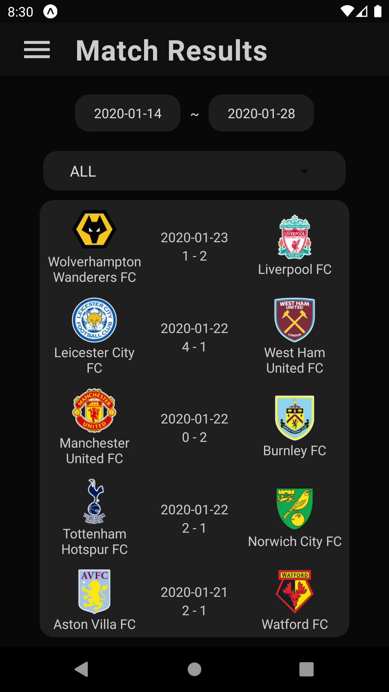
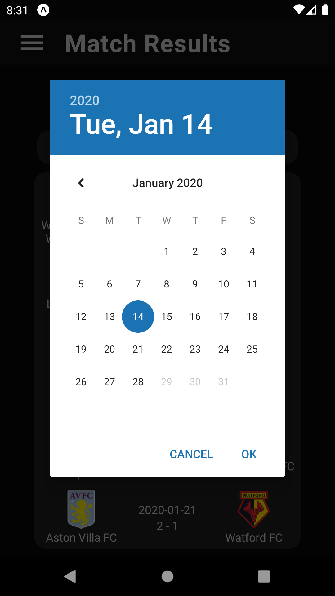
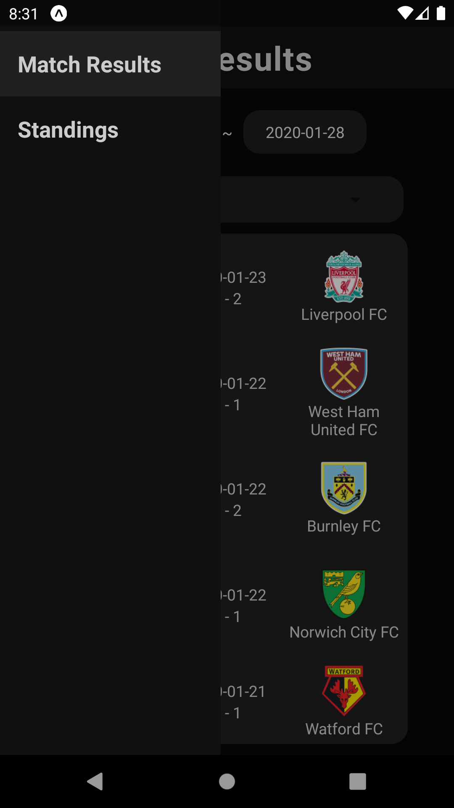
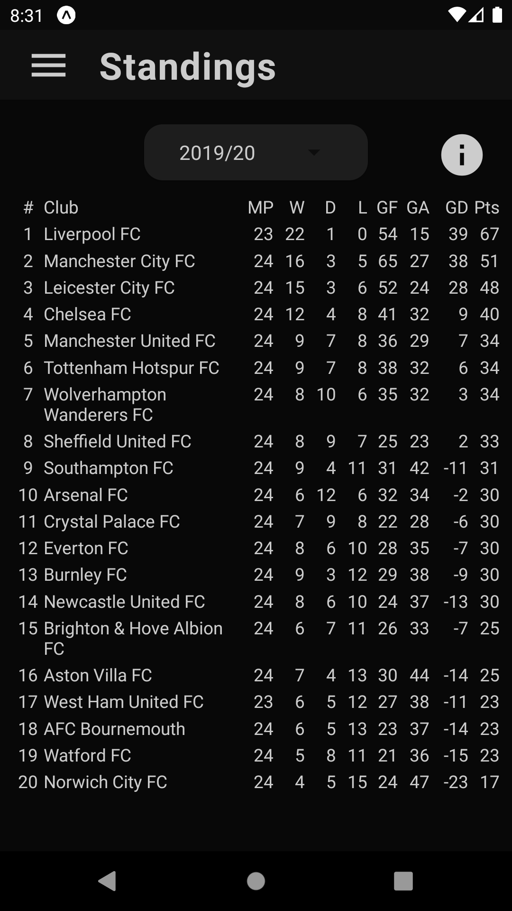
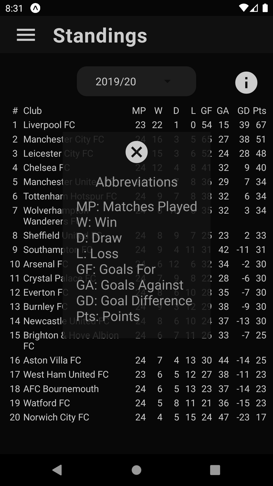
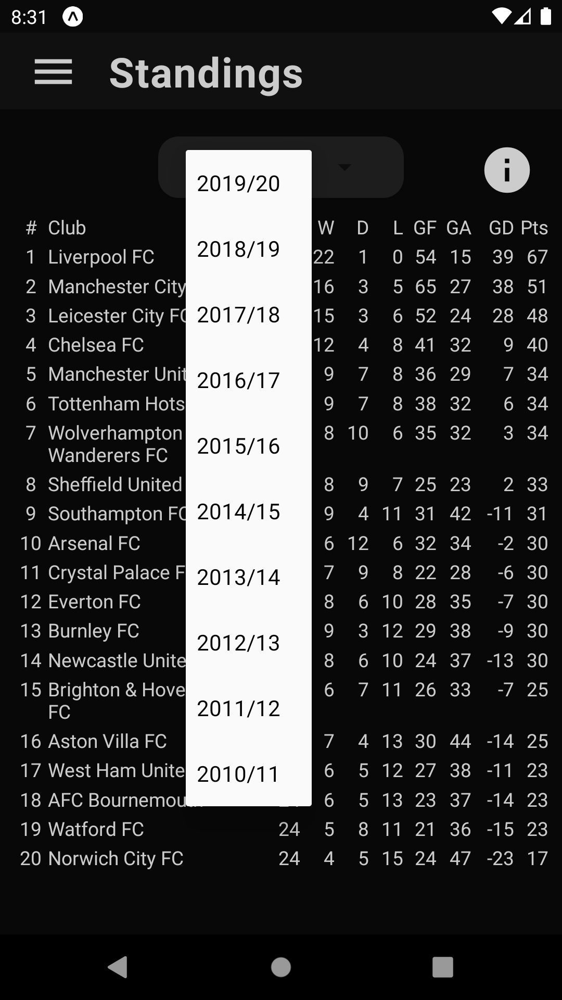

# football-score-app
Native mobile application using react native. 
You can quickly check out the English Premier League match results and standings from 2010/11 to 2019/20 season.

# Download link
Android apk file 
[Link1](https://expo.io/artifacts/a339f5df-4eeb-4ccf-8b49-79f4e06639ad)
 or 
[Link2](https://exp-shell-app-assets.s3.us-west-1.amazonaws.com/android/%40vkdltjs/football-score-124fce9f71134d96be33e6c3cc17f4cb-signed.apk)

# Screenshots

